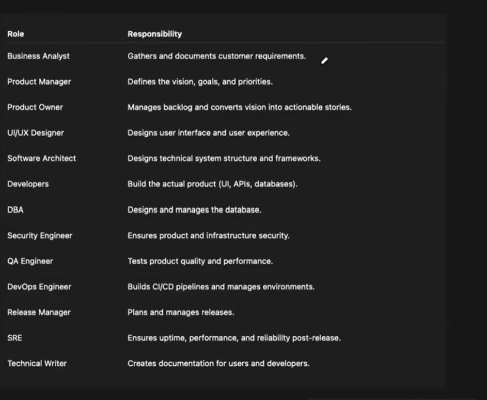

# Overview of Organization Inner Workings

## 1. Why this matters for DevOps

A DevOps engineer usually does not get requirements directly from customers. Instead, the requirement flows through different roles in the organization.

Understanding this is important because:
- it helps you know where work comes from
- it helps you understand your role in the software lifecycle
- it helps you answer interview questions about team structure and workflows
- it helps you understand how tasks are tracked in tools like Jira

---

## 2. Different roles in an organization

### Customer
- The customer gives feedback, ideas, and business needs.
- Example: "We want groceries delivered in 15 minutes."

### Business Analyst (BA)
- Interacts with customers and internal business teams.
- Gathers requirements.
- Converts customer ideas into formal business requirements.
- Creates documents such as BRD (Business Requirements Document).

### Product Manager (PM)
- Looks at the business vision and product goals.
- Prioritizes requirements based on business value and product strategy.
- Decides what should be done first.

### Product Owner (PO)
- Takes the prioritized requirement and breaks it into actionable items.
- Converts product vision into backlog items, stories, or epics.
- Defines what must be done for the feature to be considered complete.

### Software Architect / Solution Architect
- Designs the technical structure of the system.
- Defines HLD (High-Level Design) and LLD (Low-Level Design).
- Helps ensure the solution is technically feasible.

### Developers
- Build the actual product.
- Work on frontend, backend, APIs, business logic, and integrations.

### Database Administrator (DBA)
- Designs and manages the database.
- Handles schema, performance, storage, backups, and integrity.

### Security Engineer
- Ensures the product and infrastructure are secure.
- Handles authentication, authorization, encryption, security policies, and vulnerability checks.

### QA Engineer
- Tests the product for quality and performance.
- Validates whether the feature works correctly and meets requirements.

### DevOps Engineer
- Provides infrastructure and automation support.
- Creates CI/CD pipelines.
- Manages cloud resources, Kubernetes, Docker, Git, deployment automation, and environments.
- Helps speed up the delivery process and reduce manual effort.

### UI/UX Designer
- Designs user screens and user experience.
- Makes sure the interface is user-friendly and understandable.

### Release Manager
- Plans and manages releases.
- Coordinates deployment activities across teams.

### SRE (Site Reliability Engineer)
- Ensures the system is reliable, available, and performant after release.
- Creates dashboards, alerts, and monitoring.
- Handles incidents and uptime issues.

### Technical Writer
- Documents features, setups, APIs, and user guidance.
- Helps users and developers understand how to use or maintain the system.

---

## 3. Requirement flow in a real organization
.png>)
A simple requirement usually moves like this:

Customer feedback
→ Business Analyst
→ Product Manager
→ Product Owner
→ Solution Architect
→ Development Team
→ QA / DevOps / DBA
→ Release / SRE

### Example
A customer says:
> "Amazon Fresh should deliver groceries in 15 minutes across all pin codes."

Then:
- BA captures this requirement (and creates doc called BRD)
- PM prioritizes the feature (makes a check list of deliverables and compares other competitors implementation he is not technical )
- PO breaks it into smaller stories and epics(he makes list of actionable items dbs backend frontend site )
- Architect designs the solution(makes list of actionable in technical terms he has idea what capability org have and not have and revert back to pm and po-makes hld lld high level design and low level design)
- Developers and DevOps engineers plan the required (from here dev teams work devops implements solution )
- QA tests the feature
- Release and SRE support the deployment and stability after launch

---

## 4. SDLC (Software Development Life Cycle)

The software development lifecycle generally includes:

1. Planning
   - Requirements are gathered and discussed.
2. Analysis
   - Feasibility and business value are checked.
3. Design
   - HLD and LLD are created.
4. Implementation
   - Developers and DevOps engineers build the solution.
5. Testing and Integration
   - QA validates quality and functionality.
6. Maintenance / Support
   - SRE and operations teams monitor and maintain the product.

### Important idea
A requirement may look simple to the customer, but in reality it becomes complex because multiple teams work together to make it happen.

---

## 5. Where does DevOps fit in this flow?

DevOps sits mainly in the implementation and delivery part of the SDLC.

DevOps engineers help by:
- creating infrastructure
- writing Dockerfiles
- managing Kubernetes clusters
- creating Git repositories and pipelines
- automating build, test, and deployment
- integrating security checks into CI/CD
- improving delivery speed and reducing manual work

### Example DevOps responsibilities
- Build pipelines for application deployment
- Run automated tests when code changes
- Ensure secure code and secure environments
- Deploy application to dev, test, staging, and production
- Monitor services and environment health

---

## 6. Why Jira is used

Project management tools like Jira are used so everyone can see:
- who is working on what
- what is blocked
- what is in progress
- what is completed
- what is the status of the requirement

This is important because a blocked task can impact the whole organization.

### Example
If a Kubernetes cluster creation is blocked due to infrastructure issues, then the developers cannot proceed, and the overall requirement gets delayed.

That is why Jira and similar tools are used to make work visible to all stakeholders.

---

## 7. Team model: Scrum team

A Scrum team often includes:
- Developers
- DevOps engineers
- QA engineers
- DBA
- Technical writer (sometimes)

These people work together to complete the requirement. No single role can finish the work alone.

---

## 8. Short summary

This lesson explains that software delivery is not done by one person. It is a team workflow that begins with customer needs and ends with a released, monitored product.

The flow is:

Customer → Business Analyst → Product Manager → Product Owner → Architect → Developers + DevOps + QA + DBA → Release + SRE

DevOps engineers are a key part of this process because they automate, provision, deploy, and support the systems that make software delivery possible.

---

---

## 10. Final takeaway

For a DevOps engineer, the most important idea is this:

You are not just managing servers or pipelines—you are part of a bigger delivery system that connects business requirements, development work, automation, testing, deployment, and operational reliability. 
> # here you will understand and  work which part of delivery sdlc in technical work can be automated and combined or pulled apart for improving efficiency as a devops engineer

[link to the video](https://www.youtube.com/watch?v=neG2MFVFji0&list=PLdpzxOOAlwvIKMhk8WhzN1pYoJ1YU8Csa&index=3)