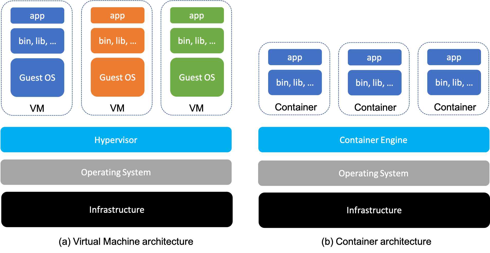

## Virtual Machines (VM)

1. What is a server?  
  > server is computer that serves / provides the application to the user when requested by client/user machine
  > in client server architecture server serves the resources 
  > in devops world key goal is efficient usage of resources provided by servers like cpus,ram by applications deployed on server 
2. Physical vs. virtual  
  > physical servers servers which are physically taangible and servers application->might not be efficient if application dont use all resources
  > virtual servers :hypervisor logically seperates the resources provided by the host physical server 
    > each logical division acts as server on its own right
    > basically virtual machines are virtual environments acts as virtual computer systems has their own cpu has their own memory
3. Hypervisor  
   > software installed on server that creates virtual machines and manage resources allocated.
4. cloud -usage of virtualisation and latency based on region
   > cloud providers use virtualisation to provide vms for millions of users using smal number of physical hosts
5. How to create a VM?  
   > A VM can be requested manually through a cloud provider's portal or created automatically using scripts and infrastructure-as-code.
   > The cloud provider selects a physical host with enough available CPU and memory, and its hypervisor creates the VM by allocating the requested resources.
   > The provider then returns connection details such as an IP address and a key pair.
6. Real-world example  
   > Imagine that AWS has many physical servers in its Mumbai data center. For this simplified example, each physical server has 100 GB of RAM and 100 CPU cores.
   >
   > A DevOps engineer in Hyderabad requests a VM in the Mumbai region using the AWS portal or an automation script. The requested VM has 10 GB of RAM and 12 CPU cores.
   >
   > AWS receives the request and looks for a physical server with enough unused resources. If physical server P100 is available, the hypervisor installed on P100 creates the VM and allocates 10 GB of RAM and 12 CPU cores to it.
   >
   > AWS provides the VM's IP address and key pair so the engineer can connect to it. The engineer has logical access to the VM but does not physically own or access the underlying server. AWS manages the data center and physical hardware while the customer pays for and uses the allocated virtual resources.

